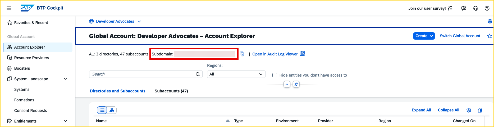
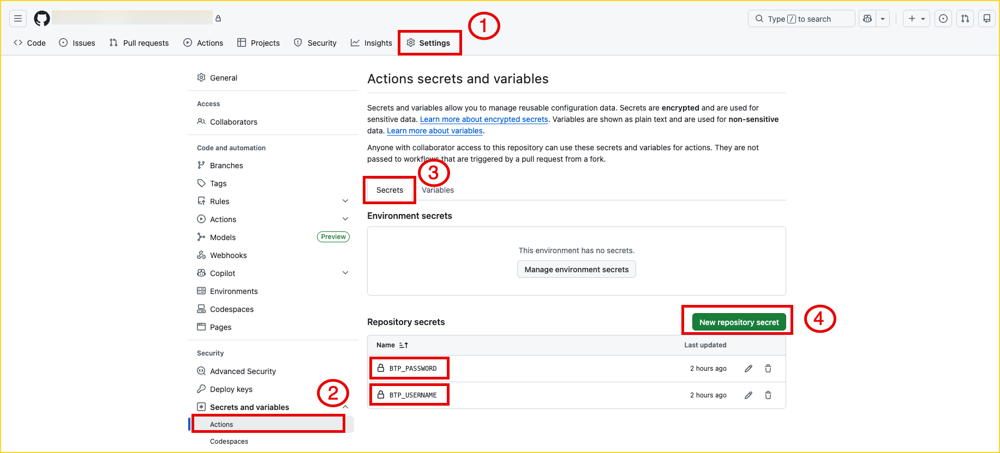
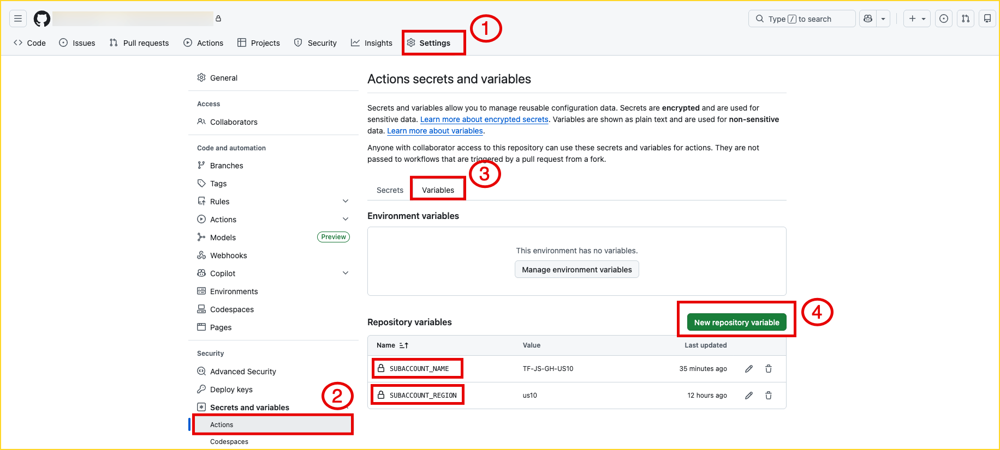
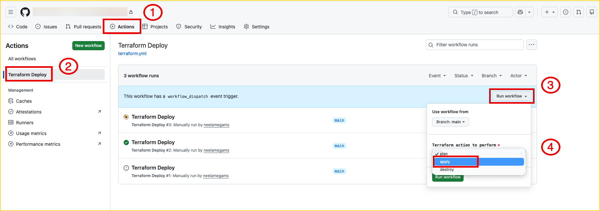
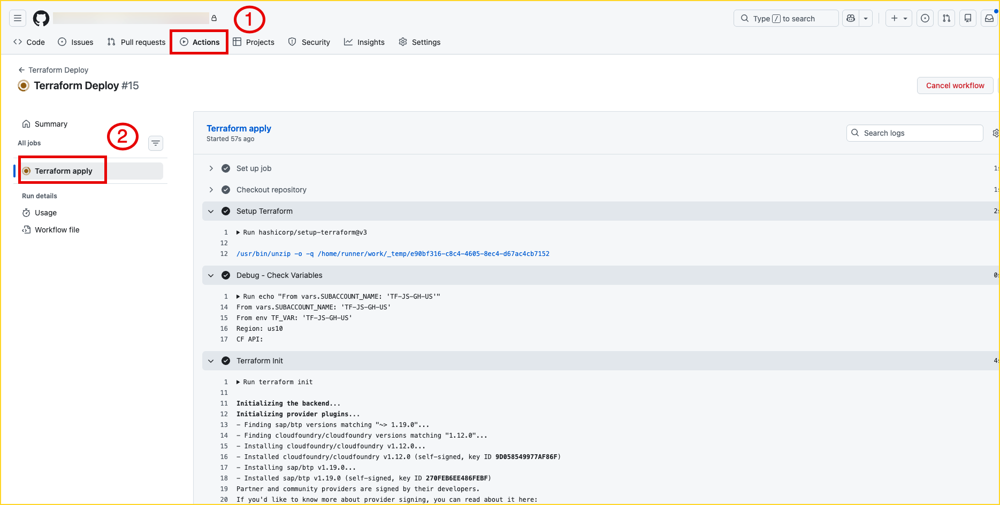

# Jumpstart your Joule Studio Setup with Terraform

<!--- Register repository https://api.reuse.software/register, then add REUSE badge:
[](https://api.reuse.software/info/github.com/SAP-samples/REPO-NAME)
-->

## Description

This repository contains Terraform scripts to setup an SAP BTP subaccount using the SAP BTP Terraform provider for Joule Studio within an exising Global account with Custom Identity Provider (Cloud Identity Services). It automatically sets up SAP Build Process Automation build-default plan, Joule standard plan, Cloud foundry, Role Collections, trust with custom IDP and more.

- `main.tf`: Provider configuration (BTP and Cloud Foundry)
- `variables.tf`: Input variables for subaccount
- `terraform.tfvars`: Configurable input variables with values
- `subaccount.tf`: Subaccount creation with subdomain sanitization logic
- `services.tf`: Subaccount entitlements and subscriptions for services(Joule, BPA, WZ, Roles, Role Collections)

## What Gets Created

This Terraform configuration provisions the following resources:

| Resource | Description |
|----------|-------------|
| Subaccount | New BTP subaccount with custom IDP trust |
| Cloud Foundry | CF environment with org and `dev` space |
| SAP Build Process Automation | Subscription (`build-default` plan) |
| Joule Studio | Subscription with `standard` plan |
| SAP Build Work Zone | Standard (`free`) |
| Role Collections | ProcessAutomationAdmin, ProcessAutomationDeveloper, Joule_Studio, Launchpad_Admin |

**Estimated time:** ~20-30 minutes for full provisioning of resources

## Requirements

Before using this template, ensure you have:

| Requirement | Description |
|-------------|-------------|
| **BTP Global Account** | With Global Account Administrator access |
| **Entitlements** | Joule (`standard` plan) and Build Process Automation (`build-default` plan) |
| **SAP Cloud Identity Services** | IAS tenant for your global account |
| **Platform User** | SAP ID Service credentials for Terraform authentication |

#### Steps to find your Identity Provider URL

1. Go to **BTP Cockpit** → **Global Account** → **Account Explorer**
2. Click on any existing subaccount
3. Navigate to **Security** → **Trust Configuration**
4. Look for an entry like `xxxxx.accounts.ondemand.com` and Copy the domain (e.g., `abc123xy.accounts.ondemand.com`)
5. You will need this url in `Step 3` of **Setup and Configuration** section

> **Don't have a custom IDP?** Most BTP accounts include SAP Cloud Identity Services. If missing, contact your administrator to enable it for your global account.

## Setup and Configuration

1. Click **Use this template** button on this repository and choose **Create a new repository**
2. Provide a repo name, make visibility of your repo as **Private** and select **Create repository***
3. Update the `terraform.tfvars` with your global account subdomain and identity_provider and commit the change. This is one time update.

```sh
   globalaccount = "xxx-xxxx-xxxx-xxxx-xxx"
   identity_provider = "xxxxx.accounts.ondemand.com"
```



4. Add 2 **Secrets** from **Settings** → **Secrets and variables** → **Actions** → **Secrets** → **New repository secret** ):

   - `BTP_USERNAME` - Your BTP email
   - `BTP_PASSWORD` - Your BTP password

   

   Note: The BTP username and password provided here should have administrator access within the global account mentioned in Step 3.

5. Add 2 **Variables** from **Settings** → **Secrets and variables** → **Actions** → **Variables** → **New repository variable** ):

   - `SUBACCOUNT_NAME` - e.g., `my-joule-studio`
   - `SUBACCOUNT_REGION` - e.g., `eu10`



Note: These variables must be updated for each new subaccount since subaccount names must be unique and the region must be a Joule supported data center. By storing them as GitHub variables, they can be modified without changing the Terraform scripts(.tf files).

6. Go to **Actions** → **Terraform Deploy** → **Run workflow** → From `Terraform action to perform` dropdown, select `apply` → **Run workflow** 



7. Monitor the deployment from the **Actions** tab



## Create a Joule Formation

The last step to complete the Joule Studio setup is to create a `Joule Formation`. By creating a formation, you logically group multiple systems and services together so they can work as a unified solution. The Formation is what makes Joule aware of the connected systems and able to orchestrate across them. Unfortunately, this cannot be automated via Terraform yet, so run the Joule booster after running the Terraform script to perform this step automatically.

## Known Issues

No known issues.


## References
- [SAP BTP Terraform Provider](https://registry.terraform.io/providers/SAP/btp/latest/docs)
- [Learning journey](https://learning.sap.com/courses/getting-started-with-terraform-on-sap-btp/adding-multiple-resources-to-the-terraform-configuration) and [MOOC Course GH repo](https://github.com/SAP-samples/btp-terraform-mooc-terra1)
- [Run Joule Booster](https://help.sap.com/docs/joule/integrating-joule-with-sap/run-booster) and [Step by Step Video](https://sapvideo.cfapps.eu10-004.hana.ondemand.com/?entry_id=1_41c6lxa0)
- [SAP help documentation](https://help.sap.com/docs/Joule_Studio/45f9d2b8914b4f0ba731570ff9a85313/b323c5a639a5428eb05fdafcca9bc9df.html?locale=en-US) and [SAP Community blog post](https://community.sap.com/t5/technology-blog-posts-by-sap/setting-up-joule-studio-for-all-customer-flows-and-entitlement-levels/ba-p/14240537)


## How to obtain support
[Create an issue](https://github.com/SAP-samples/<repository-name>/issues) in this repository if you find a bug or have questions about the content.
 
For additional support, [ask a question in SAP Community](https://answers.sap.com/questions/ask.html).

## Contributing
If you wish to contribute code, offer fixes or improvements, please send a pull request. Due to legal reasons, contributors will be asked to accept a DCO when they create the first pull request to this project. This happens in an automated fashion during the submission process. SAP uses [the standard DCO text of the Linux Foundation](https://developercertificate.org/).

## License
Copyright (c) 2026 SAP SE or an SAP affiliate company. All rights reserved. This project is licensed under the Apache Software License, version 2.0 except as noted otherwise in the [LICENSE](LICENSE) file.
